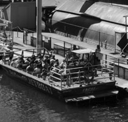
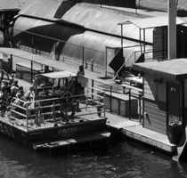
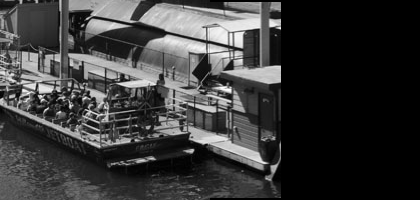

# Python Image Stitcher
## Image stitching program implemented in Python using the Harris Corner Pipeline, NCC, RANSAC, and inverse image warping

Used Pillow to decompress and load the png grayscale images into a list of lists containing pixel values.  
Used Numpy to convert image into numpy array and utilise linear algebra for calculations.

Used the Harris Corner Pipeline to find corners in two distinct but overlapping images.  
Found corners were matched using NCC to determine overlapping areas of the image.  
A homography transformation matrix was found using RANSAC to determine what amount of image manipoulation would be required to link the right image with the left image.  
Applied the homography to the right image and used inverse warping to build a final stitched image, resulting in a panorama.  
Used Billinear Interpolation during Inverse Warping whenver warped pixel coordinates were ambiguous.  

## Example
Left Image:  

Right Image:  

Final Stitched Image:  

